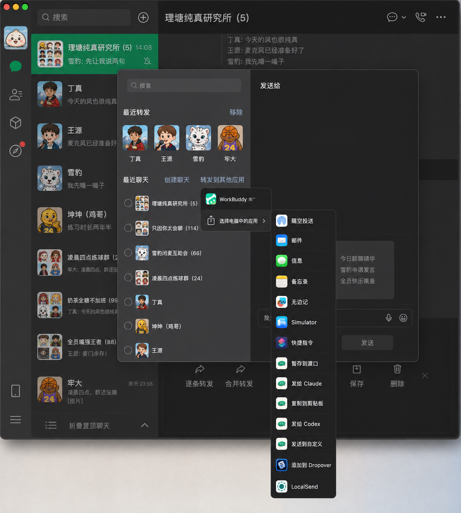
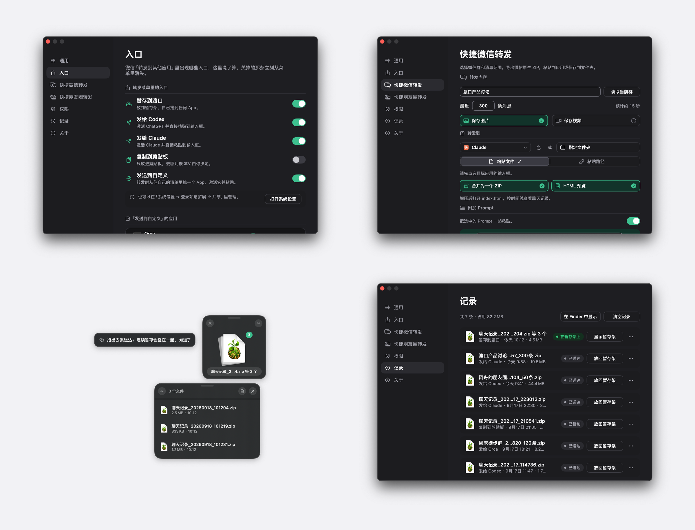

<div align="center">
  
  <h1>Dukou（渡口）</h1>
  <p><strong>在微信的转发菜单里，直接把聊天记录送到你要用的地方。</strong></p>
  <p>原生、轻量、完全本地的 macOS 微信聊天记录转发工具。</p>
  <p>简体中文 · <a href="README_EN.md">English</a></p>
  <p>
    
    
    <a href="LICENSE"></a>
    <a href="https://x.com/zerah_eth"></a>
  </p>
</div>

<p align="center">
  
</p>

<p align="center">
  
</p>

## 背景

macOS 微信 4.1.13 起，多选的聊天记录可以「合并转发」给第三方应用：微信自己把文字、图片和视频打成一个 ZIP，附一份按时间排好的 TXT。这正好是 AI agent 读一段完整信息流需要的东西，而且不碰数据库、不用密钥解密，聊天内容只走微信自己导出的文件。

问题是「转发到其他应用」的列表里只有装了共享扩展的 App：Finder、终端、Codex、Claude 都不在。Dukou 把它们补进去，转发菜单里多出五条入口，点哪条就直接到哪：

| 入口 | 做什么 |
|---|---|
| **暂存到渡口** | 放到屏幕角落的暂存架，从图标拖进任何 App |
| **发给 Codex** | 激活 ChatGPT 并粘贴到输入框 |
| **发给 Claude** | 激活 Claude 并粘贴到输入框 |
| **复制到剪贴板** | 只放进剪贴板，⌘V 由你决定 |
| **发送到自定义** | 你自己的应用清单：一个直接发过去，多个才在鼠标旁边弹一张小卡片让你选 |

再往前一步，「快捷微信转发」（实验）按群名和条数把指定群最近的消息自动导出、校验并粘贴给 agent，不用自己去多选：300 条消息全程约 30 秒。

> [!NOTE]
> 早期版本。五条入口、暂存架、自动粘贴与 Sparkle 更新都已在本机端到端跑通；大文件、多显示器与全新机器上的权限引导仍待逐项验收。

## 功能

- **扩展没有界面**：点完入口不出现任何面板，文件直接落盘。扩展在系统回收临时文件前完成复制，整批要么完整出现，要么完全不出现。
- **入口可开关**：每条入口是一个独立的系统扩展，在「设置 → 入口」里逐条开关，不必绕去系统设置。
- **Dropover 式暂存架**：不抢焦点的浮动方块，常驻你选的屏幕角落；拖出去被接受就消化，全拖完自己消失。文件不删，转进「记录」。
- **记录到期自清**：每一批记着走的入口、结果和占用；不在架上的超过保留时长（默认 7 天）自动移到废纸篓，随时能放回暂存架。
- **发到任何 App**：「发送到自定义」的清单在设置里维护，暂存架右键和记录页的「发给 ▸」用同一份；终端类应用可以只粘贴带引号的文件路径。
- **附加 Prompt**：发给 Codex / Claude / 自定义应用或快捷微信转发时，先粘一条写好的 Prompt，再粘文件（终端类应用则拼在路径前）；自带一条总结用的，最多保存 3 条，随时切换。
- **失败有兜底**：目标没装、没给权限、目标没到前台——文件一定已在剪贴板，提示里再给一个「放到暂存架」。成功不弹任何提示。
- **快捷微信转发（实验）**：填群名和条数，Dukou 通过辅助功能在微信里多选、合并转发，校验导出的 ZIP 后粘贴到你正在用的 App，目标在后台或最小化也送得到。300 条消息全程约 30 秒，超过 100 条自动分批。执行期间角落有一枚状态条报进度、随时可取消，这段时间鼠标和键盘归 Dukou。
- **安全更新**：通过 Sparkle 检查并安装 EdDSA 签名的新版本，只从 GitHub Release 下载你确认过的那一个。
- **中英双语**：界面、五条分享菜单项与错误提示都有简体中文与 English。

## 它不做什么

- 不解压、不读聊天内容、不做预览和索引。ZIP 从头到尾是一个不透明文件。
- 除了检查更新，不联网。五个扩展在沙盒里且没有网络权限，`Scripts/check-release-config.sh` 持续断言这一点；主 App 唯一的网络请求是 Sparkle 读取签名的 appcast。
- 不用私有 API。激活目标走 `NSWorkspace`，代按 ⌘V 走 `CGEvent` 加系统授权。

## 快速开始

### 系统要求

- macOS 14 或更高版本
- 构建需要 Xcode 26（Swift 6.2），[mise](https://mise.jdx.dev) 可选
- 「发给 Codex / Claude」需要装有 ChatGPT.app 或 Claude.app

### Homebrew

```bash
brew install --cask qzz0518/tap/dukou
```

后续更新用 `brew upgrade --cask dukou`，或者等 App 自己通过 Sparkle 提示。

### DMG 安装

前往 [Releases](https://github.com/qzz0518/Dukou/releases) 下载最新的 `Dukou-*.dmg`，打开后将 Dukou 拖入 Applications。Homebrew 与 Releases 是同一份经过 Developer ID 签名和 Apple 公证的 Universal 2 DMG。

### 从源码构建

```bash
git clone https://github.com/qzz0518/Dukou.git
cd Dukou
mise run reinstall   # 组装并签名 dist/Dukou.app，安装到 ~/Applications
```

不用 mise 的等价命令：

```bash
CONFIG=release Scripts/make-app.sh
Scripts/install-dev-build.sh
```

构建脚本会自动选用钥匙串里稳定的 Developer ID / Apple Development 身份。这对辅助功能权限很重要：TCC 按代码签名记忆授权，ad-hoc 签名每次重建都要重新授权。

### 第一次使用

1. 打开 Dukou，四步向导会带你打开需要的入口。新装的共享扩展默认**未启用**，不打开就不会出现在转发菜单里。
2. 想用自动粘贴，给「辅助功能」授权。跳过也行，第一次转发失败时 Dukou 会再引导一次。
3. 微信里多选聊天记录 → 转发到其他应用 → 选你要的那一条。

## 隐私

| 数据 | Dukou 的处理方式 |
|---|---|
| 微信导出的 ZIP | 复制进 App Group 容器原样保存，不解压、不读取内容 |
| 剪贴板 | 只写入文件 URL、附加的 Prompt 文本，或终端类应用要的路径 |
| 网络 | 只有软件更新：Sparkle 定期读取 GitHub Pages 上的签名 appcast，并仅从 GitHub Release 下载你确认的新版本 |
| 沙盒 | 五个扩展全部在沙盒里；主 App 不开沙盒，因为入口开关要调用 `pluginkit`，而 `pkd` 拒绝沙盒进程 |

## 开发

| 命令 | 用途 |
|---|---|
| `mise run build` | 构建三个 target |
| `mise run test` | 运行测试 |
| `mise run i18n` | 校验中英资源与源码引用是否一致 |
| `mise run release-config` | 校验 bundle id、App Group、entitlement 与五条入口 |
| `mise run bundle` | 组装并签名本机架构的 `dist/Dukou.app` |
| `mise run bundle-universal` | 同上，Universal 2 |
| `mise run install` / `reinstall` | 安装到 `~/Applications`；`reinstall` 先重建 |
| `mise run icon` | 从 `Resources/AppIcon-artwork.png` 生成 PNG、ICNS 与 README 图标 |
| `mise run dmg-background` | 画 DMG 打开时的 Finder 背景 |
| `mise run release-dry-run` | 用 Developer ID 生成未公证的 Universal 2 候选 DMG |
| `mise run release` | 从干净 tag 构建、签名、公证、staple 并生成签名 appcast |
| `mise run verify` | 构建、测试、校验、打包，一步全做 |

```text
Sources/
├── DukouCore/    收件箱协议、manifest、转发意图、批次状态；以及微信自动化里可单独测试的纯逻辑
├── DukouShare/   共享扩展：只有导入与落盘，没有界面
└── DukouApp/     常驻 App、暂存架、自动粘贴、权限引导、设置窗口、微信自动化、Sparkle 更新
Tests/            收件箱、批次状态、转发目标与微信记录解析的测试
```

五个 `.appex` 共用一份可执行文件，靠 `DKShareAction` 区分。扩展把文件复制进 App Group 的 `Inbox/Staging`，写完 manifest 与 intent 后整个目录一次 rename 到 `Inbox/Ready`；主 App 监听目录变化，消费 intent（读即删，所以只执行一次）。

## 参与项目

- [报告问题](https://github.com/qzz0518/Dukou/issues)
- [在 X 关注 @zerah_eth](https://x.com/zerah_eth)

## 许可证

[MIT](LICENSE)
